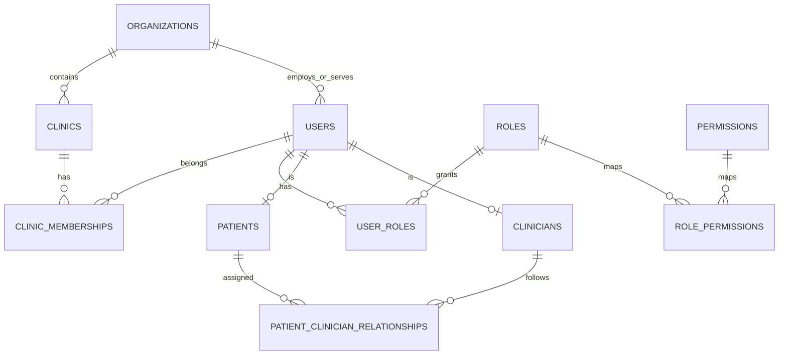

# Modèle de données V2 (PostgreSQL)

Statut : conception Phase 1. Implémentation en Alembic à partir de la Phase 2 (`backend/alembic/`).
Étend `docs/architecture/data-model.md` (v1). Reprend le schéma des 11 migrations SQLite de v1 (`backend/app/db.py::MIGRATIONS`) en le transposant vers PostgreSQL **avec tenant et RLS** (ADR-008).

---

## 1. Conventions

- **Identifiants** : `uuid` généré côté serveur (`uuid7` si extension disponible, sinon `uuid4`). Jamais d'identifiant analytique ré-identifiant.
- **Temps** : `timestamptz` UTC. `created_at`, `updated_at`, acteur de mutation quand pertinent.
- **Suppression** : `deleted_at` pour les entités fonctionnelles ; `audit_logs` et `security_events` sont **append-only**.
- **Tenant** : toute table de donnée de tenant porte `organization_id uuid NOT NULL REFERENCES organizations(id)`. Les tables globales (§4) ne l'ont pas et sont listées explicitement.
- **RLS** : activée sur toutes les tables de tenant. Politique `USING (organization_id = current_setting('app.current_organization')::uuid)`. La session applicative pose `SET LOCAL app.current_organization = ...` après authentification, avant toute requête métier.
- **Chiffrement applicatif par champ** : pour le contenu de message, les réponses PHQ-9, les métadonnées PII de patient. Clés via gestionnaire de secrets, jamais en base.
- **Versionnement** : toute donnée issue d'une politique ou d'un modèle porte `policy_version` / `model_version` / `rules_version`.
- **Concurrence** : les transitions d'état critiques utilisent `UPDATE ... WHERE id=? AND status=<état lu>` + vérification `rowcount` (leçon SEC-001 de v1), pas `SELECT` puis `UPDATE`.

---

## 2. Tenant & identité

| Table | Colonnes essentielles | Contraintes / notes |
| --- | --- | --- |
| `organizations` | id, name, slug, status, created_at | **globale** (pas de RLS). slug unique. |
| `clinics` | id, **organization_id**, name, status | RLS. index (organization_id, status). |
| `users` | id, **organization_id**, email_normalized, password_hash, status, mfa_enabled, mfa_secret_enc, deleted_at | RLS. `UNIQUE(organization_id, email_normalized) WHERE deleted_at IS NULL`. PBKDF2 aujourd'hui, **Argon2id** dès qu'`argon2-cffi` est adopté (ADR-006 permet la dépendance — c'est une amélioration de la Phase 2). |
| `clinic_memberships` | user_id, clinic_id, **organization_id**, role_in_clinic | RLS. un clinicien ↔ plusieurs cliniques de **sa** org. |
| `patients` | id, user_id, **organization_id**, pseudonym, pii_metadata_enc, created_at | RLS. `user_id` unique. |
| `clinicians` | id, user_id, **organization_id**, pseudonym, credentials_note, created_at | RLS. `user_id` unique. |
| `roles` | id, code, description | **globale**. codes : `PATIENT, PSYCHOLOGIST, CLINICAL_SUPERVISOR, RESEARCHER, ML_ENGINEER, SECURITY_AUDITOR, ADMIN, SUPER_ADMIN`. |
| `permissions`, `role_permissions`, `user_roles` | ... | permissions **deny-by-default**. `user_roles` porte `organization_id` (RLS) sauf pour `SUPER_ADMIN` (global, audit renforcé). |
| `patient_clinician_relationships` | id, **organization_id**, patient_id, clinician_id, status(`ACTIVE`/`ENDED`), created_by, created_at, ends_at | RLS. `UNIQUE(patient_id, clinician_id) WHERE status='ACTIVE'`. CHECK applicatif + trigger : patient et clinicien de la **même** organization. |
| `sessions` | id, **organization_id**, user_id, token_hash, expires_at, revoked_at | RLS. `token_hash` unique. rotation à l'authentification. |

---

## 3. Consentement, profil, conversation, évaluation

| Table | Colonnes essentielles | Notes |
| --- | --- | --- |
| `consent_versions` | id, purpose, version, document_ref, published_at | **globale**. purpose ∈ `CARE, LEARNING, AI_EXTERNAL, VOICE, ANALYTICS, RESEARCH`. |
| `consents` | id, **organization_id**, user_id, purpose, version, granted_at, revoked_at, evidence_ref | RLS. `UNIQUE(user_id, purpose, version)`. index (user_id, purpose) WHERE revoked_at IS NULL. **`AI_EXTERNAL`** et **`VOICE`** nouveaux vs v1. |
| `profiles` | user_id, **organization_id**, display_name, about_me_enc, language, onboarding_completed_at, updated_at | RLS. `about_me` chiffré (texte libre patient — injecté dans le prompt système, donc sensible : TH-04). |
| `communication_preferences` | user_id, **organization_id**, tone, response_length, question_frequency, directiveness, updated_at | RLS. alimente le Personalization Engine. Jamais inféré comme vérité — déclaré ou dérivé avec confiance explicite. |
| `goals` | id, **organization_id**, user_id, title, description_enc, status, created_at, updated_at | RLS. jamais imposé automatiquement (§56). |
| `goal_progress` | id, goal_id, **organization_id**, value, note_enc, recorded_at | RLS. |
| `conversations` | id, **organization_id**, patient_id, status(`ACTIVE`/`CLOSED`), created_at, updated_at | RLS. index (patient_id, created_at DESC). |
| `conversation_state` | conversation_id, **organization_id**, stage, current_topic, active_goal_id, risk_state, interaction_style_json, language, updated_at | RLS. snapshot de l'état Redis (§5 overview-v2). |
| `messages` | id, **organization_id**, conversation_id, author_type(`PATIENT`/`ASSISTANT`), content_enc, sequence_no, responder_version, generation_path(`FAST`/`DEEP`/`TEMPLATE`), llm_provider, crisis_event_id, created_at | RLS. `UNIQUE(conversation_id, sequence_no)`. `generation_path` + `llm_provider` nouveaux (traçabilité ADR-007). |
| `phq9_assessments` | id, **organization_id**, user_id, instrument_version, answers_enc, total_score(0–27), item9_score(0–3), completed_at | RLS. index (user_id, completed_at DESC). |
| `assessment_reminders` | id, **organization_id**, user_id, due_at, status | RLS. |

---

## 4. Sécurité, alertes, notifications (portées de v1, + tenant)

| Table | Colonnes essentielles | Notes |
| --- | --- | --- |
| `crisis_policies` | version, country, thresholds_json, sla_json, approved_by, approved_at | **globale** (politique plateforme). Bloquée si `approved_by IS NULL` hors `development`. |
| `crisis_rules` | version, high_risk_terms, concern_terms, approved_by | **globale**. |
| `response_templates` | version, green/orange/red_json, approved_by, approved_at | **globale**. |
| `risk_assessments` | id, **organization_id**, patient_id, input_reference, score(0–1), confidence(0–1), model_version, model_available, emotion_label, emotion_confidence, emotion_model_version, created_at | RLS. `input_reference` = id du message (clé d'idempotence, leçon TM-09). |
| `crisis_events` | id, **organization_id**, risk_assessment_id, patient_id, level(`GREEN`/`ORANGE`/`RED`), reasons, rules_version, policy_version, created_at | RLS. append-only. |
| `alerts` | id, **organization_id**, patient_id, crisis_event_id, level, status, idempotency_key, score, policy_version, sla_due_at, assigned_clinician_id, created_at, acknowledged_at | RLS. `idempotency_key` unique. statuts : `DETECTED→CREATED→NOTIFIED→ACKNOWLEDGED→IN_REVIEW→ESCALATED→RESOLVED→CLOSED` (+`CANCELLED` selon politique). transitions atomiques. |
| `alert_actions` | id, alert_id, **organization_id**, actor_id, action, justification, created_at | RLS. append-only. **chaque transition auditée** (§32). |
| `notifications` | id, **organization_id**, alert_id, channel, template_version, delivery_status(`PENDING`/`SENT`/`FAILED`/`SKIPPED_NO_CHANNEL`), provider_ref, attempt_count, next_retry_at, idempotency_key, created_at, updated_at | RLS. `idempotency_key` unique. **outbox transactionnelle** : la ligne est écrite dans la même transaction que l'alerte, l'envoi est fait par un worker (ferme TM-08 — leçon v1). |
| `notification_channels` | id, **organization_id**, channel, config_enc, is_active | RLS. **par organisation** : chaque établissement configure ses propres canaux/destinataires. |

---

## 5. Mémoire (nouveau — Phase 5)

| Table | Colonnes essentielles | Notes |
| --- | --- | --- |
| `memories` | id, **organization_id**, user_id, type(`WORKING`/`EPISODIC`/`SEMANTIC`/`LONGITUDINAL`), content_enc, embedding `vector(N)`, provenance(`USER_DECLARED`/`MODEL_INFERRED`/`CLINICIAN_VALIDATED`/`SYSTEM_DERIVED`/`TEMPORARY`), confidence, sensitivity, consent_scope, status(`ACTIVE`/`UNCERTAIN`/`EXPIRED`/`REVOKED`/`CLINICIAN_VALIDATED`), source_conversation_id, source_message_id, created_at, updated_at, expires_at | RLS. index HNSW pgvector sur `embedding` **filtré `WHERE status='ACTIVE'`**. Retrieval ne lit jamais une mémoire non-`ACTIVE`. |
| `longitudinal_snapshots` | id, **organization_id**, user_id, emotion_trend_json, phq9_trend_json, goal_trend_json, risk_trend_json, engagement_json, computed_at | RLS. précalculé par worker après chaque conversation (§78). jamais un diagnostic — corrélations statistiques annotées comme telles. |

**Révocation** : `revoke_consent('CARE')` → `UPDATE memories SET status='REVOKED' WHERE user_id=?`. Test dédié : une mémoire `REVOKED` n'apparaît dans aucun contexte.

---

## 6. Apprentissage & MLOps (porté de v1, + tenant + MLflow en Phase 17)

| Table | Colonnes essentielles | Notes |
| --- | --- | --- |
| `human_feedback` | id, **organization_id**, message_id (unique), anonymized_content, anonymization_version, review_status(`PENDING`/`APPROVED`/`REJECTED`), reviewed_by, review_justification, reviewed_at, sampled_at | RLS. échantillonné seulement si consentement `LEARNING` actif au moment du sampling. anonymisation regex **puis** revue humaine. |
| `clinician_response_reviews` | id, **organization_id**, message_id, reviewer_id, decision(`APPROVE`/`EDIT`/`REJECT`/`FLAG_SAFETY`), corrected_response_enc, scores_json(empathy/relevance/personalization/context/safety/clarity/usefulness 1–5), feedback_type, clinical_comment_enc, model_version, policy_version, created_at | RLS. **AI Review Center** (§38–39). |
| `training_datasets` | id, version (unique), status(`DRAFT`/`FINALIZED`), sampling_policy, privacy_policy, annotation_policy, label_schema, quality_score, approval_status, created_by, created_at, item_count | **globale** (dataset plateforme). immuable après `FINALIZED`. |
| `training_dataset_items` | dataset_id, human_feedback_id | PK composite. |
| `model_versions` | id, kind(`LLM`/`EMOTION`/`RISK`/`CRISIS`/`EMBEDDING`), version, dataset_id, environment(`EXPERIMENTAL`/`STAGING`/`SHADOW`/`CANARY`/`PRODUCTION`/`RETIRED`), status(`DRAFT`/`PENDING_REVIEW`/`APPROVED`/`DEPLOYED`/`ROLLED_BACK`/`REJECTED`), metrics_json, mlflow_run_id, checksum, created_by, created_at | **globale**. `UNIQUE(kind, version)`. |
| `model_approvals` | id, model_version_id, approver_id, decision(`APPROVED`/`REJECTED`), justification, created_at | `UNIQUE(model_version_id, approver_id)`. **2 approbations distinctes** requises (contrainte en base + application). un `REJECTED` bloque définitivement (leçon SEC-001 : transition atomique). |

---

## 7. Audit, analytics, configuration

| Table | Colonnes essentielles | Notes |
| --- | --- | --- |
| `audit_logs` | id, occurred_at, request_id, correlation_id, **organization_id**, actor_id, action, resource_type, resource_id, outcome(`SUCCESS`/`DENIED`/`FAILURE`), metadata_json | append-only. RLS en lecture ; écriture par tous les modules. **jamais de contenu clinique** dans `metadata_json`. |
| `security_events` | id, occurred_at, kind, severity, ip_hash, correlation_id, details_json | append-only. globale (exploitation). |
| `analytics_events` | id, occurred_at, subject_pseudonym, event_type, properties_json | **jamais** e-mail/nom/contenu. `subject_pseudonym` dérivé et **tournant**. alimenté par événements de domaine uniquement. |
| `feature_flags` | key, environment, value_json, description, updated_by, updated_at | flags : `voice, new_llm, new_risk_model, new_memory, new_dashboard, one_question_policy, experimental_features`. |
| `system_configurations` | key, environment, version, value_enc, approved_by, created_at | `UNIQUE(key, environment, version)`. audit obligatoire. |

---

## 8. Mapping migration v1 → v2

| v1 (SQLite) | v2 (PostgreSQL) | Transformation |
| --- | --- | --- |
| `001_foundation` (users, sessions, audit_logs) | `organizations`, `clinics`, `users`, `sessions`, `audit_logs` | + `organization_id`, + RLS, + `roles/permissions` normalisés (v1 a `role` en colonne CHECK), + `correlation_id` |
| `002_patient_platform` (profiles, consents, deletion_requests) | idem + `communication_preferences` | + `organization_id`, `about_me` chiffré, `language` ; purposes de consentement étendus |
| `003_phq9` | `phq9_assessments` + `assessment_reminders` | + `organization_id`, `answers` chiffrées |
| `004_alerts` + `005_crisis_and_notifications` | `risk_assessments`, `crisis_events`, `alerts`, `alert_actions`, `notifications`, `notification_channels` | + `organization_id`, statuts d'alerte étendus (`DETECTED`/`NOTIFIED`), outbox stricte, canaux par org |
| `006_patient_clinician_relationships` | idem | + `organization_id`, trigger same-org |
| `007_conversations` (conversations, messages) | idem + `conversation_state` | + `organization_id`, `content` chiffré, `generation_path`, `llm_provider` |
| `008_emotion_observability` | colonnes dans `risk_assessments` | inchangé (déjà bien) |
| `009_notification_retry_scheduling` | `notifications.next_retry_at` | inchangé |
| `010_continuous_learning` | `human_feedback`, `training_datasets`, `model_versions`, `model_approvals` + `clinician_response_reviews` | + `environment` sur `model_versions`, + `mlflow_run_id`, + dataset lineage metadata |
| `011_profile_details` (`about_me`) | `profiles.about_me_enc` | chiffré |

**Aucune donnée à migrer** (aucune donnée patient réelle n'existe). La première migration Alembic crée le schéma cible complet ; les migrations SQLite v1 restent l'historique de `backend/app/db.py` jusqu'au retrait du code v1.

---

## 9. Index & performance (à valider Phase 19 sous charge réelle)

- `messages (conversation_id, sequence_no)` ; `messages (organization_id, created_at DESC)`
- `memories` : index HNSW pgvector partiel `WHERE status='ACTIVE'` ; b-tree `(user_id, type, status)`
- `alerts (organization_id, status, level, sla_due_at)` ; `alerts (assigned_clinician_id, status)`
- `audit_logs (occurred_at)` ; `audit_logs (organization_id, actor_id, occurred_at)` — partitionnement par mois envisagé si volume
- `risk_assessments (patient_id, created_at DESC)`
- pagination **cursor-based** partout (jamais `OFFSET` sur de gros ensembles — §77)
