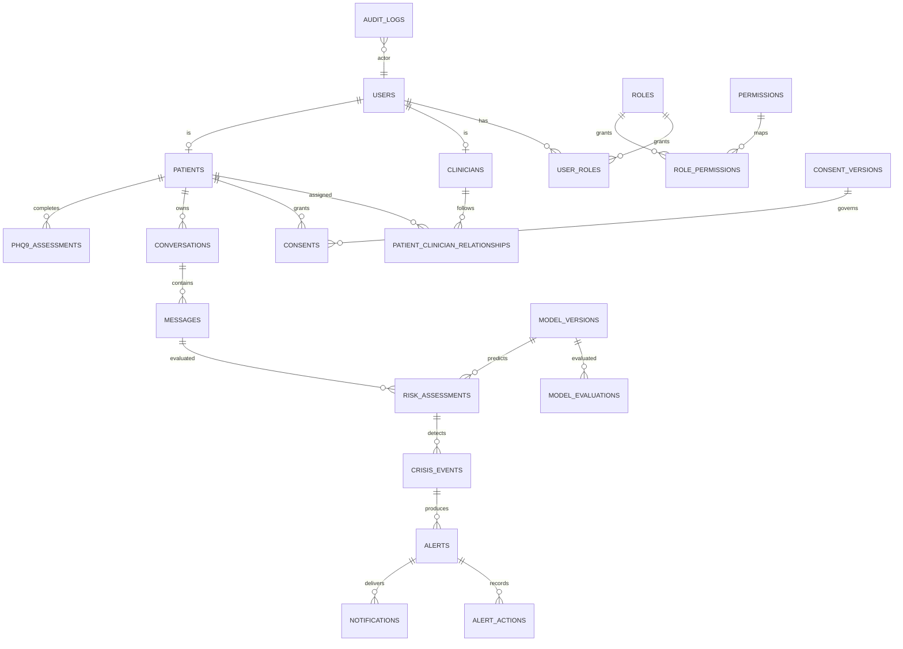

# Modèle de données cible

## Conventions

- Identifiants : UUID v7 ou UUID v4 générés côté serveur ; aucun identifiant analytique directement ré-identifiant.
- Temps : `timestamptz` UTC ; `created_at`, `updated_at` et acteur de mutation lorsque pertinent.
- Suppression : `deleted_at` uniquement pour les entités fonctionnelles appropriées ; l’audit est append-only et soumis à rétention validée.
- Données sensibles : chiffrement applicatif par champ pour les valeurs qui le justifient ; index minimisés et recherche sur dérivés autorisés.
- Toute table clinique porte un propriétaire, une provenance et une version quand l’information est versionnable.

## Entités et relations

## Tables principales

| Table | Colonnes essentielles | Contraintes / index |
| --- | --- | --- |
| `users` | id, email_normalized, password_hash, status, mfa_state, deleted_at | email unique parmi comptes actifs ; jamais de secret en clair |
| `roles`, `permissions`, jonctions | id, code, description | codes uniques ; permissions refusées par défaut |
| `clinicians`, `patients` | id, user_id, pseudonym, metadata chiffrée | `user_id` unique ; PII séparée/chiffrée |
| `patient_clinician_relationships` | patient_id, clinician_id, status, approved_at, ends_at | relation active unique ; index patient/status et clinician/status |
| `consent_versions`, `consents` | version, purpose, accepted_at, revoked_at, evidence_ref | une décision par version/finalité ; index patient/finalité/actif |
| `conversations`, `messages` | patient_id, status, content_ref chiffrée, sequence_no, author_type | unicité conversation/sequence ; index patient/date |
| `assessments`, `phq9_assessments` | instrument_version, answers chiffrées, total_score, completed_at | score 0–27 ; réponse 0–3 ; index patient/date |
| `risk_assessments` | input_ref, level, score, confidence, policy_version, model_version | index message et level/date ; sortie signée ou checksumée |
| `crisis_events` | risk_assessment_id, trigger_refs, decision, policy_version | index patient/date via jointure ; append-only |
| `alerts`, `alert_actions` | level, status, priority, idempotency_key, SLA, actor, justification | idempotency unique ; transitions d’état contrôlées ; index statut/priorité/SLA |
| `notifications` | alert_id, channel, template_version, delivery_status, provider_ref, idempotency_key | idempotence par alerte/canal/classe ; données minimisées |
| `model_versions`, `model_evaluations` | kind, version, checksum, dataset_ref, status, metrics, approved_by | version unique par modèle ; déploiement approuvé uniquement |
| `human_feedback`, `training_datasets` | source_ref, anonymization_status, review_status, lineage | dataset non éligible sans opt-in et revue |
| `audit_logs`, `security_events` | correlation_id, actor_ref, action, resource_ref, outcome, metadata redacted | append-only ; index date/acteur/ressource |
| `feature_flags`, `system_configurations` | key, environment, version, value chiffrée si nécessaire, approved_by | unique key/environnement/version ; audit obligatoire |

## États contrôlés

`alerts.status` : `OPEN → ACKNOWLEDGED → IN_REVIEW → ESCALATED | RESOLVED → CLOSED`, avec `CANCELLED` seulement selon politique. Chaque transition exige un acteur autorisé, un horodatage et une justification lorsque la politique l’exige.

Les données analytiques reçoivent un `subject_pseudonym` dérivé et tournant ; elles ne portent ni e-mail, ni nom, ni contenu conversationnel non anonymisé.

