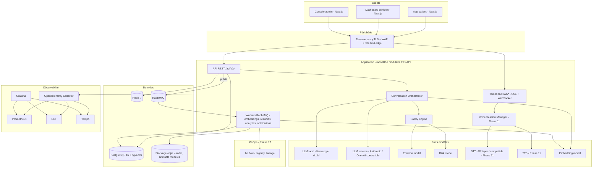

# Architecture cible V2

Statut : établie en Phase 1 (2026-08-28), sur la base de `docs/reports/phase-0-audit-v2.md` et des décisions D-1 à D-4.
Portée : ce document décrit la **cible**. L'implémentation suit la roadmap Phase 0 Section 8, en strangler pattern. Ce qui n'est pas encore construit est marqué _(à venir — Phase N)_.

Ce document **étend** `docs/architecture/overview.md` (v1). Les invariants de sûreté de la v1 (§ « Invariants de sûreté ») sont repris tels quels et re-testés sur la nouvelle stack.

---

## 1. Principe directeur

Le produit n'est pas `User → LLM → Answer`. C'est un pipeline gouverné où la génération de langage est **une étape parmi d'autres**, encadrée en amont par la sécurité et la construction de contexte, en aval par la vérification de sortie.

```text
USER ──(texte / voix)──▶ REAL-TIME INPUT LAYER
                              │
                              ▼
                     CONVERSATION ORCHESTRATOR
       ┌──────────────┬───────┴────────┬─────────────────┐
       ▼              ▼                ▼                 ▼
  CONTEXT ENGINE  PERSONALIZATION  MEMORY RETRIEVAL   DIALOGUE POLICY
       └──────────────┴───────┬────────┴─────────────────┘
                              ▼
              SAFETY / RISK / CRISIS ENGINE   ◀── indépendant du LLM, s'exécute AVANT lui
                              │
                     ┌────────┴────────┐
              GREEN   │                 │  ORANGE / RED
                      ▼                 ▼
              MODEL ROUTER        GABARITS FIXES VERSIONNÉS (approval-gated)
              (FAST / DEEP)              │
                      ▼                  │
              LLM PROVIDER(S)            │
                      ▼                  │
              OUTPUT SAFETY  ◀───────────┘  (PII, hallucination, cohérence de crise, non-diagnostic)
                      │
                      ▼
        PERSONALIZED RESPONSE ──(texte / voix stream)──▶ USER

En parallèle, hors chemin critique :
  Conversation ─▶ Events ─▶ Analytics ─▶ Clinical Monitoring ─▶ Human Feedback
              ─▶ Learning Pipeline ─▶ Evaluation ─▶ Model Registry ─▶ Controlled Deployment
```

---

## 2. Vue conteneurs (C4 niveau 2)



---

## 3. Découpage en modules de domaine

Un **monolithe modulaire** (ADR-001 tient) : un seul déployable, mais des frontières de module imposées dans le code (packages Python séparés, dépendances autorisées explicites, événements de domaine pour le découplage). Extraction en service seulement sur besoin démontré (candidats : Voice Session Manager, Model Inference, Learning Pipeline).

| Module | Responsabilité | Dépend de (autorisé) |
| --- | --- | --- |
| `identity` | comptes, sessions, MFA, mots de passe | `audit`, ports secrets |
| `tenancy` | organisation, clinique, contexte de tenant, RLS | `audit` |
| `authz` | RBAC (8 rôles), permissions, relation patient-clinicien active | `identity`, `tenancy`, `audit` |
| `consent` | versions, opt-in, retrait, finalité (`CARE`, `LEARNING`, `AI_EXTERNAL`, `VOICE`, `ANALYTICS`, `RESEARCH`) | `identity`, `audit` |
| `profile` | profil utilisateur étendu, préférences de communication, objectifs déclarés | `identity`, `consent` |
| `conversation` | conversations, messages, état de dialogue, streaming | `authz`, `consent`, `safety`, `orchestrator` |
| `orchestrator` | Conversation Orchestrator, Context Engine, Dialogue Policy, Model Router | `memory`, `personalization`, `safety`, ports modèles |
| `memory` | 4 niveaux (working/episodic/semantic/longitudinal), retrieval pgvector, oubli, révocation | `consent`, port embeddings |
| `personalization` | Personalization Engine : ton, longueur, directivité, style, langue | `profile`, `consent` |
| `safety` | Risk Classifier, Crisis Detector, Rule Engine, Policy Engine, Escalation Engine, Output Safety | `policy`, ports modèles risque/émotion, `audit` |
| `policy` | chargement / validation des politiques versionnées (crise, règles, templates, seuils) | `audit` |
| `assessment` | PHQ-9 versionné, scoring, historique, tendance, rappels | `authz`, `consent`, `audit` |
| `alerting` | cycle de vie d'alerte, SLA, escalade, idempotence, outbox transactionnelle | `safety`, `authz`, `audit` |
| `notifications` | NotificationService, adapters Email/SMS/Push, retry/backoff/dedup/fallback | `alerting`, `audit`, port queue |
| `clinical` | Patient 360, PatientSummaryService + Evidence, timeline, AI Review Center, feedback structuré | `conversation`, `assessment`, `alerting`, `safety` |
| `voice` _(Phase 11)_ | Voice Session Manager, VAD, streaming STT/TTS, barge-in, WebRTC | `orchestrator`, ports STT/TTS |
| `learning` | sampling consenti, anonymisation, human feedback, datasets, model versions, approbations | `consent`, `clinical`, ports stockage |
| `mlops` _(Phase 17)_ | MLflow, environnements de modèle, data quality gates, model cards | `learning` |
| `analytics` | analytics produit + clinique/IA, séparés et gouvernés | événements uniquement (jamais lecture directe des tables cliniques) |
| `observability` | OpenTelemetry, corrélation d'identifiants, dashboards | transverse |
| `administration` | politiques, feature flags, santé système, bootstrap | tous, via commandes auditées |

**Règle de dépendance** : `analytics` ne lit jamais directement une table clinique — il ne consomme que des événements de domaine, sur un pseudonyme tournant. `safety` ne dépend jamais de `orchestrator` ni d'un LLM.

---

## 4. Le chemin d'un message (texte)

_(cible ; Phases 4→7 pour le cœur, complété ensuite)_

1. **Ingress** : `POST /api/v1/conversations/{id}/messages` (ou trame WS). Auth Bearer → `TenantContext` + `user`. RLS positionnée.
2. **Validation** : longueur, encodage, conversation active possédée par le patient, consentement `CARE` actif. Rate limit distribué (Redis).
3. **Persistance du message patient** (transactionnel, `sequence_no`).
4. **Safety Engine** (avant toute génération) :
   - `normalize()` → `RuleEngine` (termes versionnés) → `RiskClassifier` (port modèle, fail-safe : une panne n'abaisse jamais la prudence) → `CrisisDetector` combine (max score / min confiance) → `PolicyEngine` applique les seuils versionnés → décision `GREEN | ORANGE | RED | UNKNOWN` (`UNKNOWN` traité comme ≥ ORANGE).
   - Décision persistée avec `policy_version`, `rules_version`, `model_version`, `reasons`.
5. **Branche selon le niveau** :
   - **ORANGE / RED / UNKNOWN** → réponse = gabarit fixe versionné (approval-gated) ; `AlertEngine` crée une alerte idempotente (outbox) → `NotificationService` (asynchrone via RabbitMQ). **Aucun appel LLM.** Fin du chemin critique.
   - **GREEN** → étapes 6–9.
6. **Context Engine** (`ContextBuilder`) assemble le **contexte minimal suffisant** : politique système + politique de sécurité + session courante + profil + mémoire pertinente (retrieval, §6) + résumé longitudinal + objectif courant + état de dialogue. Jamais « tout injecter ».
7. **Dialogue Policy** classe la complexité → **FAST** ou **DEEP** (ADR-007). **Personalization Engine** ajuste ton/longueur/directivité selon le profil.
8. **Model Router** :
   - FAST → LLM local (stream).
   - DEEP + consentement `AI_EXTERNAL` actif → LLM externe (stream).
   - DEEP sans consentement → dégrade en FAST local.
   - LLM externe indisponible (`health_check`) → repli local.
9. **Output Safety** sur le texte généré : détection PII, revendication de diagnostic, incohérence avec la décision de crise, affirmation non étayée. Échec → réponse de repli sûre (`SAFE_FALLBACK`), jamais la sortie brute.
10. **Persistance de la réponse** + stream au client (SSE/WS). Publication d'un événement `MessageCreated` → workers (embeddings mémoire, analytics, précalcul de résumé) **hors chemin critique**.

**Latence** : le client reçoit le premier token dès l'étape 8 (streaming). Les étapes 4–7 visent < 500 ms cumulé pour le FAST path.

---

## 5. Conversation Orchestrator & Dialogue State

`ConversationOrchestrator` est le composant central (§16 du prompt). Il ne contient pas de logique métier de sécurité — il **appelle** `SafetyEngine`. Responsabilités : stratégie de conversation, construction de contexte, retrieval mémoire, sélection de modèle, gestion du streaming, mise à jour de l'état, émission d'événements.

**Dialogue State** (par session, stocké Redis + snapshot PostgreSQL) :

```yaml
conversation_state:
  stage: WELCOME | EXPLORATION | CLARIFICATION | REFLECTION | SUPPORT | ACTION | FOLLOW_UP | CRISIS | HANDOFF | CLOSURE
  current_topic: str | null
  active_goal: goal_id | null
  emotional_state: {label, confidence}      # observabilité, jamais décisionnel
  risk_state: GREEN | ORANGE | RED | UNKNOWN
  user_intent: str | null
  last_question: str | null                 # pour la One-Question Policy
  unresolved_topics: [str]
  interaction_style: {tone, length, directiveness, question_frequency}
  language: fr | en | ...
```

**Conversation Naturalness Engine** (§18) : stratégie `ACKNOWLEDGE → REFLECT → CONNECT → CLARIFY → RESPOND → ONE NEXT QUESTION`, encodée comme contraintes de prompt + post-traitement, pas comme des listes numérotées.
**One-Question Policy** (§19) : quand `emotional_state` indique une charge élevée, la réponse est limitée à 1 reformulation + 1 question ciblée. Configurable (feature flag `one_question_policy`).

---

## 6. Memory Engine

_(Phase 5)_ `MemoryService`, 4 niveaux :

| Niveau | Contenu | Stockage |
| --- | --- | --- |
| Working | session courante | Redis (TTL) |
| Episodic | événements précédemment racontés par le patient | PostgreSQL + embedding pgvector |
| Semantic | informations récurrentes | PostgreSQL + embedding pgvector |
| Longitudinal | évolution agrégée (tendances émotion/PHQ-9/objectifs/risque/engagement) | PostgreSQL, précalculé par worker |

**Objet mémoire** : `id, organization_id, user_id, type, content, embedding, source_conversation, source_message, created_at, updated_at, confidence, sensitivity, consent_scope, status`.
**Statuts** : `ACTIVE | UNCERTAIN | EXPIRED | REVOKED | CLINICIAN_VALIDATED`.
**Provenance** : `USER_DECLARED | MODEL_INFERRED | CLINICIAN_VALIDATED | SYSTEM_DERIVED | TEMPORARY`. Une mémoire `MODEL_INFERRED` porte une confiance explicite et n'est jamais traitée comme un fait.

**Retrieval** (§24) : `message courant → embedding → recherche vectorielle → filtrage métadonnées → pertinence temporelle → score d'importance → filtrage sécurité → top-K → Context Builder`. Jamais « tout l'historique ». Priorité : pertinence, récence, importance, confiance, consentement.
**Oubli / révocation** (§25, §86) : une mémoire `REVOKED` ou `EXPIRED` ou supprimée n'est plus jamais injectée ; la révocation de consentement `CARE` marque `REVOKED` en cascade ; test dédié à chaque build.

---

## 7. Safety Engine (indépendant du LLM)

_(Phase 7 ; le cœur `crisis`/`policy` est porté de v1 en Phase B avant tout le reste)_

```text
message ─▶ RuleEngine ──┐
          RiskClassifier ─┼─▶ CrisisDetector (max score / min confiance)
          (port modèle)   │         │
          contexte ───────┘         ▼
          signaux temporels ─▶ PolicyEngine (seuils versionnés) ─▶ EscalationEngine
                                        │
                                        ▼
                         GREEN | ORANGE | RED | UNKNOWN
```

- **`RuleEngine`** : termes haut-risque / de préoccupation versionnés (`crisis-rules-vN.json`).
- **`RiskClassifier`** : port `RiskModel` (`predict(text) -> (score, confidence)`), fail-safe (exception → `model_available=False`, confiance plafonnée, jamais de baisse de prudence).
- **`CrisisDetector`** : combine par maximum de score et minimum de confiance (jamais l'inverse) — logique portée de `backend/app/crisis.py` v1 quasi telle quelle.
- **`PolicyEngine`** : applique `crisis-policy-vN.json` (seuils `red_score`, `orange_score`, `orange_confidence_floor`, SLA, `human_review_required`). Refuse de charger une politique sans `approved_by` hors environnement `development`.
- **`EscalationEngine`** : mappe niveau → création d'alerte + SLA + canaux, selon la politique.
- **`OutputSafety`** : pipeline sur toute réponse générée — `PII check → safety check → clinical policy check → crisis consistency check → hallucination / unsupported claim check → final`. Échec → `SAFE_FALLBACK`.
- **Défense prompt injection** (§61) : le contenu récupéré (mémoire, RAG, `about_me`) est encadré dans le prompt comme _données_, jamais comme instructions ; le prompt système est non divulgable ; tentative de changement de politique de sécurité ignorée par construction (le LLM n'a pas accès à la politique). Suite AI red team versionnée.

**`SAFE_FALLBACK`** (§30) : déclenché sur modèle indisponible, timeout, incohérence, faible confiance, perte réseau, panne notification, erreur DB. Ne produit jamais de fausse assurance ; propose un message neutre de soutien + rappel des ressources d'urgence locales ; journalise l'incident.

---

## 8. Modèles & ports

| Port | Interface | Adaptateurs |
| --- | --- | --- |
| `LLMProvider` | `generate(prompt, context)`, `stream(...)`, `health_check()` | `local` (llama.cpp / vLLM), `anthropic`, `openai`, `openai-compatible` |
| `EmotionModel` | `predict(text) -> (label, confidence)` | modèle entraîné (observabilité seule — jamais référencé par `safety`) |
| `RiskModel` | `predict(text) -> (score, confidence)` ; `version` | `KeywordRiskModel` (porté v1), modèle entraîné futur |
| `EmbeddingModel` | `embed(text) -> vector` | modèle local (sentence-transformers) ou service |
| `SpeechToTextProvider` _(P11)_ | `stream_transcribe(audio)` → partiels + final, timestamps, confiance, langue | Whisper auto-hébergé, API compatible |
| `TextToSpeechProvider` _(P11)_ | `stream_synthesize(text, voice, lang)`, interruption | fournisseur local, cloud |

**Model Router** (§106) : `simple → FAST_MODEL` ; `conversation normale → STANDARD_MODEL` ; `raisonnement complexe → DEEP_REASONING_MODEL` ; `haut risque → jamais de LLM, pipeline sécurité + gabarit`.

---

## 9. Données — voir `docs/architecture/data-model-v2.md`

PostgreSQL 16 source de vérité unique. pgvector pour les embeddings. Redis ne stocke **jamais** une donnée clinique critique comme seule copie (§6 du prompt). Toute table de tenant porte `organization_id` + RLS (ADR-008).

---

## 10. Temps réel

- **WebSocket** (`/ws/*`) : événements, état de dialogue, transcript, stream de texte, notifications. Fourni nativement par FastAPI.
- **SSE** : alternative pour le seul stream de réponse texte quand un WS bidirectionnel n'est pas nécessaire.
- **WebRTC** _(Phase 11)_ : média audio temps réel (voix), avec repli WebSocket. `VoiceSessionManager` : `micro → capture → VAD → STT streaming → Orchestrator → LLM streaming → TTS streaming → sortie audio`, avec barge-in (interruption immédiate du TTS), pause/reprise, reconnexion réseau, gestion des permissions micro, détection de silence, timeout.

---

## 11. Observabilité

OpenTelemetry (traces + métriques + logs), architecture vendor-neutral → Prometheus / Grafana / Loki / Tempo.
**Corrélation** : chaque requête propage `request_id, session_id, conversation_id, message_id, model_request_id, alert_id, notification_id`.
**Dashboards** : API p50/p95/p99 ; LLM TTFT / latence totale ; STT / TTS ; DB / Redis / queue ; TTFT / TTFA / TTLT côté produit.
**Interdit** : contenu clinique brut, jeton, secret dans les traces ou logs (règle héritée v1, TH-09).

---

## 12. Sécurité (résumé — détail dans `docs/security/threat-model-v2.md`)

OWASP Top 10 + OWASP API Security + **OWASP LLM/GenAI Top 10** + **NIST AI RMF (profil GenAI)** + STRIDE. RBAC 8 rôles (`PATIENT`, `PSYCHOLOGIST`, `CLINICAL_SUPERVISOR`, `RESEARCHER`, `ML_ENGINEER`, `SECURITY_AUDITOR`, `ADMIN`, `SUPER_ADMIN`). `PATIENT` n'a jamais accès au dashboard clinique. `RESEARCHER` ne reçoit que des données dé-identifiées autorisées. Secrets hors Git (gestionnaire dédié). Audit append-only sans contenu clinique.

---

## 13. Déploiement

- **Dev / test / CI** : Docker Compose (app, postgres+pgvector, redis, rabbitmq, otel-collector, mailhog). `docker compose up` + `pytest` = contrat reproductible.
- **Staging / shadow / production** _(à venir)_ : reverse proxy TLS + WAF en périphérie ; app stateless en réseau privé ; secrets injectés au runtime ; Postgres/Redis/RabbitMQ/objet en sous-réseaux privés, chiffrés au repos, sauvegardés et restaurés-testés ; observabilité séparée à rétention minimisée.
- **Kubernetes/Helm** : seulement si la charge le justifie (ADR-006). Pas dans le MVP.

---

## 14. Structure de dépôt (coexistence v1 / v2)

Le code v1 (`backend/`, `frontend/`) **reste en place et exécutable** jusqu'à son remplacement module par module (strangler pattern, ADR-006). La v2 vit dans des répertoires neufs pour éviter toute collision d'import ou de packaging :

```text
backend/            # V1 — Python stdlib + SQLite, INCHANGÉ (démo Railway). Retiré phase par phase.
frontend/           # V1 — SPA vanilla, INCHANGÉ.

server/             # V2 — API (FastAPI, monolithe modulaire)
  app/
    api/            # routes FastAPI (transport uniquement, aucune logique métier)
    core/           # config, db+RLS, redis, crypto, sécurité, logging/otel, erreurs RFC 9457, context
    domain/         # entités et règles métier pures, par module (identity, safety, ...)   (à venir)
    application/    # services applicatifs / cas d'usage (auth_service, rbac, audit, ...)
    infrastructure/ # modèles SQLAlchemy, repositories, adaptateurs Redis/RabbitMQ, clients modèles
    ai/providers/   # openai/ anthropic/ local/ compatible/                                 (Phase 4+)
    ai/routing/     # ModelRouter, DialoguePolicy                                           (Phase 4+)
    conversations/ memory/ safety/ clinical/ voice/ learning/ mlops/ analytics/            (phases dédiées)
    alembic/        # migrations (versions/0001_foundation.py, ...)
  scripts/          # bootstrap idempotent, tâches d'exploitation
  tests/            # pytest : unit / integration / contract / e2e / security / ai_redteam / perf / resilience

web/                # V2 — frontend Next.js                                                (Phase 3)
  patient/ clinician/ admin/       # 3 espaces (ou une app à 3 zones)
  packages/design-system/          # tokens, composants, primitives

config/policies/    # politiques versionnées (partagées, reprises de v1)
docs/               # architecture, ADR, sécurité, clinique, déploiement, rapports
ops/                # otel-collector-config, dashboards Grafana, runbooks
docker-compose.yml  # stack de dev/test/CI V2 (postgres+pgvector, redis, rabbitmq, otel, mailpit, api)
```

Quand un module v2 atteint la parité de test avec son équivalent v1, le code v1 correspondant est retiré dans la phase qui le remplace — jamais avant. À la fin (Phase 23), `backend/` et `frontend/` disparaissent ; `server/` et `web/` peuvent alors être renommés si souhaité.

---

## 15. Invariants de sûreté (repris de la v1, re-testés sur la stack V2)

1. Un LLM (local ou externe) ne peut ni déclencher seul une crise ni appeler un outil à privilège.
2. Toute alerte est persistée avant publication ; la livraison est idempotente.
3. Toute ressource clinique est filtrée par organisation (RLS), rôle, relation active, consentement et finalité.
4. Chaque décision de risque référence les versions de politique, règles et modèles.
5. Les configurations d'urgence, seuils et canaux sont hors du code, versionnés et approuvés.
6. Les logs techniques n'incluent jamais de contenu clinique brut, jeton, mot de passe ou secret.
7. _(nouveau)_ Aucune donnée de message classée ORANGE/RED n'atteint un fournisseur LLM externe.
8. _(nouveau)_ Le chemin DEEP (LLM externe) exige un consentement `AI_EXTERNAL` actif ; à défaut, dégradation locale, jamais transfert.
9. _(nouveau)_ Une mémoire révoquée, expirée ou supprimée n'est jamais réinjectée dans un contexte.
