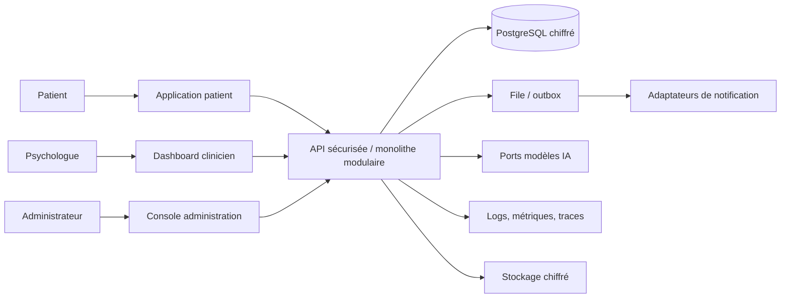
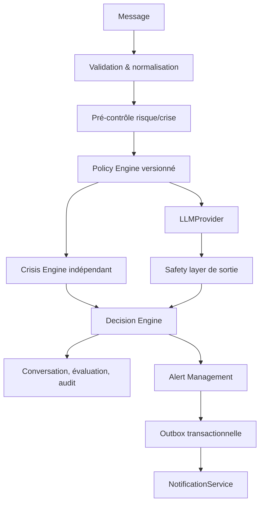

# Architecture cible

## Décision

Le pilote démarre comme un monolithe modulaire API-first. Chaque module ne dépend que de contrats applicatifs et d’interfaces de ports ; les adaptateurs (PostgreSQL, queue, fournisseur IA, courriel) sont remplaçables. Cette forme minimise la complexité et maintient la cohérence transactionnelle des données sensibles, tout en préparant une extraction future par domaine.

## C4 — contexte et conteneurs

## Composants logiques

| Domaine | Responsabilité | Dépendances autorisées |
| --- | --- | --- |
| Identity / Authentication | identifiants, sessions, MFA, récupération | Authorization, Audit, ports de secrets |
| Authorization | RBAC, permissions, relation patient-clinicien | Identity, Patient, Audit |
| Consent | versions, opt-in, retrait, finalité | Identity, Patient, Audit |
| Conversation | messages, historique autorisé, références de contenu | Identity, Consent, Risk |
| Assessment | questionnaires versionnés et PHQ-9 | Patient, Consent, Audit |
| Risk & Crisis | signaux, règles, incertitude, décision explicable | Policy, ports modèles, Audit |
| Alert & Notification | cycle de vie, SLA, idempotence, delivery | Risk, Patient, Audit, queue |
| Clinical feedback | annotations et corrections supervisées | Conversation, Alert, Audit |
| Learning & Model Management | datasets, approbations, registry, rollback | Consent, feedback, ports stockage |
| Administration | politiques, feature flags, santé système | tous via commandes auditées |

## Invariants de sûreté

1. Un LLM ne peut ni déclencher seul une crise ni appeler un outil à privilège.
2. Toute alerte est persistée avant publication ; la livraison est idempotente.
3. Toute ressource clinique est filtrée par rôle, relation active, consentement et finalité.
4. Chaque décision de risque référence les versions de politique, règles et modèles.
5. Les configurations d’urgence, seuils et canaux sont hors du code, versionnés et approuvés.
6. Les logs techniques n’incluent jamais de contenu clinique brut, jeton, mot de passe ou secret.

## Flux d’apprentissage contrôlé

```mermaid
flowchart LR
  Prod[Production] --> Sample[Échantillonnage]
  Sample --> Consent[Contrôle opt-in]
  Consent --> Privacy[Filtre confidentialité & anonymisation]
  Privacy --> Review[Revue psychologue]
  Review --> Dataset[Dataset versionné]
  Dataset --> Offline[Entraînement et évaluation hors ligne]
  Offline --> Clinical[Validation clinique + sécurité]
  Clinical --> Shadow[Shadow / canary]
  Shadow --> Deploy[Déploiement approuvé]
  Deploy --> Rollback[Rollback disponible]
```

## Déploiement physique cible

- Reverse proxy TLS, WAF et limitation de débit en périphérie.
- Application stateless en réseau privé ; secrets injectés au runtime par gestionnaire dédié.
- PostgreSQL, queue et stockage objet dans des sous-réseaux privés ; chiffrement au repos, sauvegardes chiffrées et tests de restauration.
- Observabilité séparée avec rétention minimisée, redaction et contrôles d’accès.
- Les fournisseurs IA et de notification sont des sorties egress explicitement autorisées, journalisées et désactivables.

## Critères d’extraction future

Extraire un module uniquement si son profil de charge, sa frontière de données et son besoin de déploiement indépendant sont démontrés. Candidats : Notification Delivery, Model Inference et pipeline Offline Learning. Alert, Consent et Audit restent transactionnellement proches tant que le pilote l’exige.

